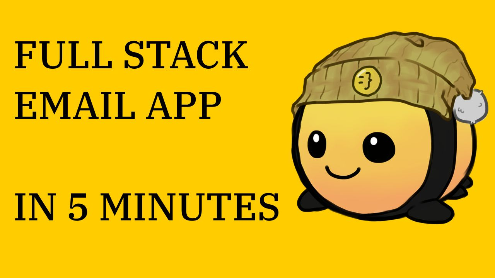

<h1 align="center">
  HiveMail
</h1>

<a href="https://youtu.be/pJjTAyBU0as" target="_blank">
  <p align="center">
    
  </p>
</a>

<a href="https://youtu.be/pJjTAyBU0as" target="_blank">
  <p align="center">YouTube tutorial about making this app</p>
</a>

---

HiveMail is a Full-stack app made with [Wasp](https://wasp-lang.dev/) that lets you send e-mails to the future ⏳

> 🐝 Legend says, mails are stored in the beehive until they will be sent to the receiver


## Usage

First, start db in one terminal:

```bash
wasp db start
```

Then, start app:

```bash
wasp start
```

Inspect DB:

```bash
wasp db studio
```
